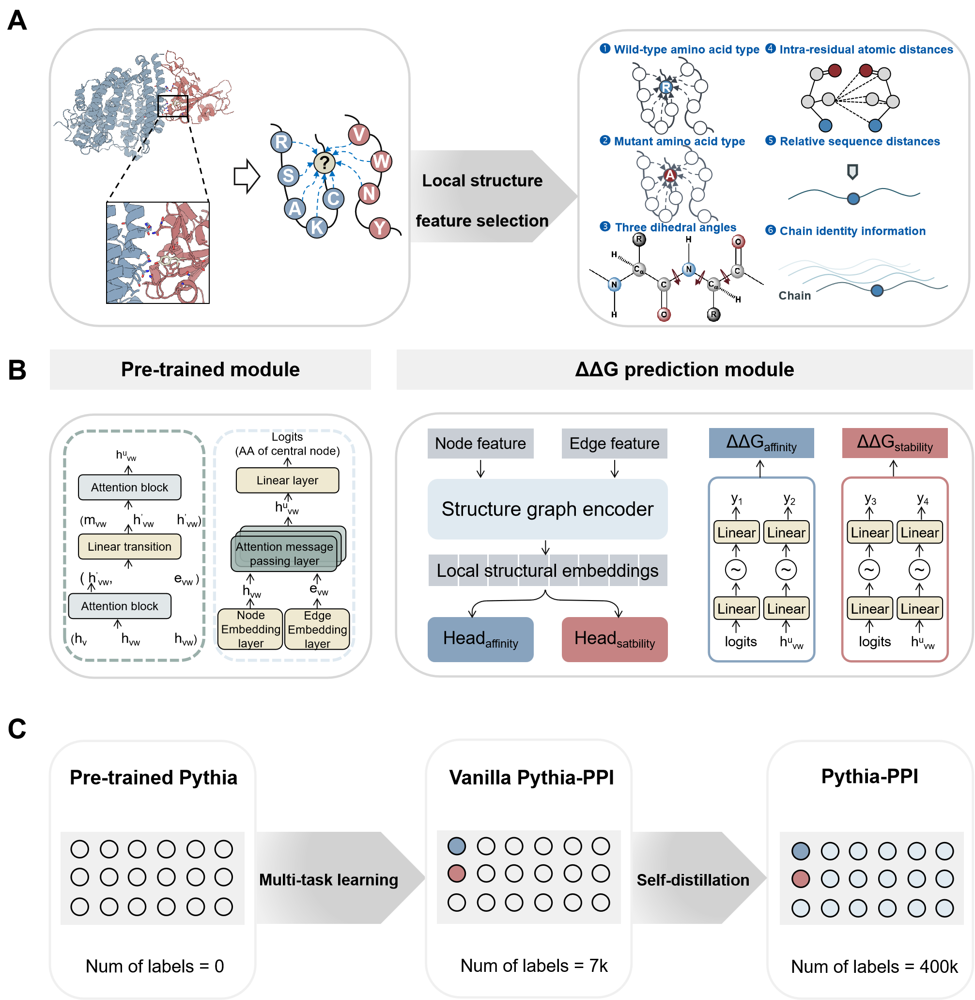

# Pythia-PPI

Pythia-PPI can predict protein-protein interaction binding affinity changes upon single-point mutations, as well as protein stability changes, through the combination of multi-task learning and self-distillation.
## Installation
To install Pythia-PPI, first clone this repository
```
git clone https://github.com/Wublab/pythia_ppi.git
```
To install the necessary python dependencies, then use the file ```environment.yml```
```
conda env create -f environment.yml -j -1
```
## Dataset Availability
The datasets in this study can be found in the following locations from the Google Drive(Note: To save time on model training, we also provide the corresponding feature data of these dataset.):

SKEMPI Dataset: https://drive.google.com/drive/folders/1z4xXDEDSNAp2MeWAT1KKfjtuxKUz361W

FireProt Dataset: https://drive.google.com/drive/folders/1AJ3ylSQvHq_RcJ3tWlK94YDdocuCP6y6

R3669 Dataset: https://drive.google.com/drive/folders/16MRNopn7dABr3xU7-aSAzXab_R5b1kh5
## Inference
example
```
python inference.py ./example/1CSE.pdb
```
